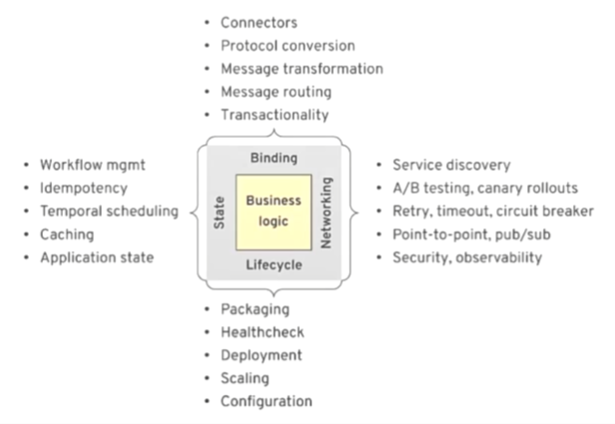
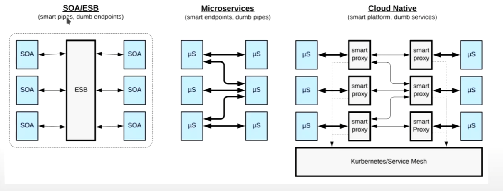
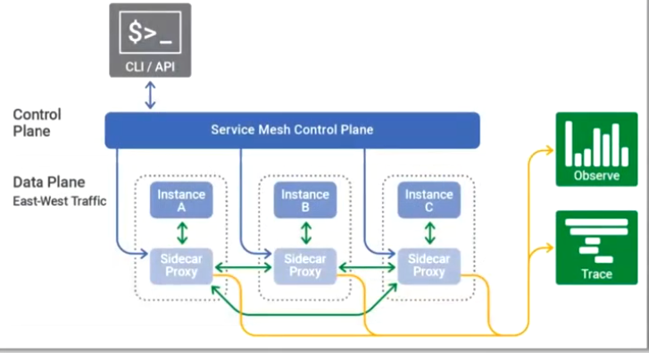
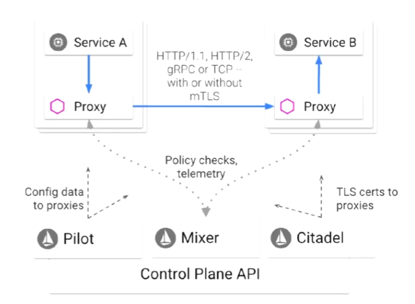
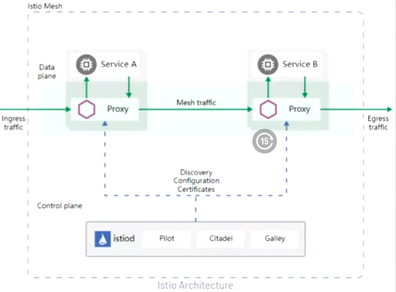
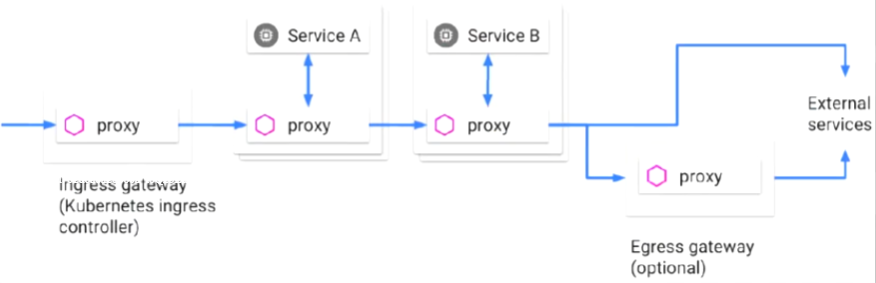
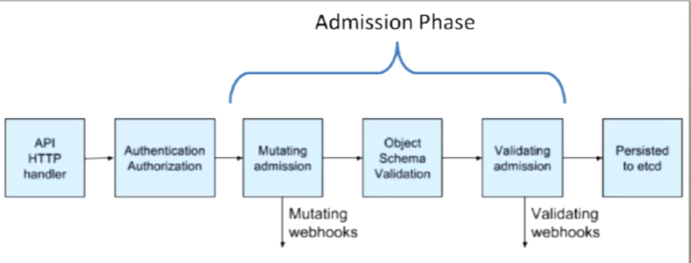
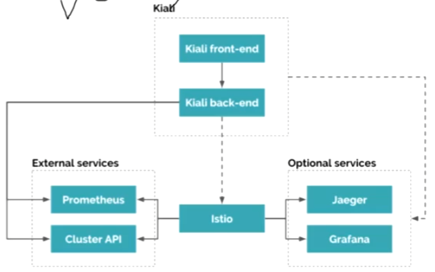

serviceMesh之Istio入门与实践


Service Mesh

## 问题总结

1、kubernetes的CRD是什么？

```txt

在Kubernetes中，CRD代表自定义资源定义（Custom Resource Definition）。CRD是一种扩展机制，允许用户定义自己的自定义资源类型，以满足特定应用或领域的需求。

Kubernetes本身提供了一些内置的资源类型，如Pod、Service、Deployment等。但是，有时候这些内置资源类型无法满足特定的业务需求，这时就可以使用CRD来创建自定义资源类型。

CRD允许用户定义自己的API对象，这些对象在Kubernetes中可以像内置资源一样进行管理和操作。通过CRD，用户可以定义自己的资源模式（Schema）和行为，以及与之关联的自定义控制器，用于处理这些资源的创建、更新和删除等操作。

CRD的创建需要以下步骤：

1.创建一个CRD对象的定义文件，其中包含资源的名称、版本、字段和其他属性。
2.使用Kubernetes API或kubectl工具将CRD定义文件提交到Kubernetes集群中。
3.Kubernetes API服务器将验证CRD定义，并在通过后将其注册为新的资源类型。
4.一旦CRD被注册，用户就可以使用kubectl或其他Kubernetes客户端工具来创建、查看、更新和删除自定义资源对象。
CRD的使用场景非常广泛，可以用于创建各种自定义资源类型，如特定应用的配置、监控指标、数据库实例等。它为Kubernetes提供了极大的灵活性和可扩展性，使得Kubernetes可以更好地适应不同的应用需求
```

2、k8s有什么资源？

```txt
在Kubernetes中，有许多内置的资源类型可供使用，以及可以通过CRD创建的自定义资源类型。以下是一些常见的资源类型：

内置资源类型：

1.Pod：是Kubernetes中最小的部署单位，用于运行应用程序的实例。
2.Service：定义一组Pod的访问规则，并提供稳定的网络端点。
3.Deployment：用于声明式地定义Pod和ReplicaSet的创建和更新策略。
4.ReplicaSet：确保指定数量的Pod副本正在运行。
5.StatefulSet：用于有状态应用程序，为每个Pod分配唯一标识符和稳定的网络标识。
6.DaemonSet：确保每个节点上都运行一个Pod副本。
7.Job：用于运行一次性任务或批处理作业。
8.ConfigMap：用于存储配置数据，可以被Pod或其他资源挂载和使用。
9.Secret：用于存储敏感数据，如密码、API密钥等。
10.Namespace：用于将集群划分为多个虚拟集群。
除了以上内置资源类型，用户还可以通过CRD创建自定义资源类型，以满足特定应用或领域的需求。一些常见的自定义资源类型包括：

1.CustomResourceDefinition：用于定义自定义资源的定义本身。
2.CustomResource：由用户定义的自定义资源类型的实例对象。
3.CustomController：自定义控制器，用于处理和管理自定义资源的创建、更新和删除等操作。
4.CustomMetrics：用于自定义指标和监控。

这只是一小部分资源类型的例子，Kubernetes还提供了更多的资源类型和扩展机制，可以根据具体需求进行自定义和扩展。
```

3、 CRD配置什么类型的资源，有什么实际案例，用于什么场景。 

```
CRD可以用来配置和定义任何类型的自定义资源。实际案例和使用场景可以根据具体的应用需求而定。以下是一些常见的实际案例和使用场景：

1.应用配置和部署：通过CRD可以创建自定义资源类型来定义应用程序的配置，例如数据库实例、消息队列、缓存集群等。这些自定义资源可以包含应用程序特定的配置参数，使得应用程序的配置和部署可以通过Kubernetes进行集中管理和自动化。

2.多租户和命名空间隔离：使用CRD可以创建自定义资源类型来实现多租户或多项目的隔离。通过定义具有不同权限和资源配额的自定义资源类型，可以为不同的团队或用户提供独立的命名空间和资源环境。

3.应用监控和自动扩展：CRD可以用于创建自定义资源类型来定义应用程序的监控指标和警报规则。自定义资源可以与监控工具集成，收集应用程序的度量数据，并根据定义的规则进行警报和自动扩展操作。

4.容器化基础设施管理：CRD可以用于创建自定义资源类型来定义容器化基础设施的管理对象，例如容器网络、存储卷、服务发现等。通过自定义资源类型，可以扩展Kubernetes的功能，以满足特定的容器化基础设施管理需求。

5.CI/CD和持续部署：使用CRD可以创建自定义资源类型来定义CI/CD流水线和持续部署的配置。自定义资源可以包含构建和部署的规则、触发条件、镜像版本等信息，以便通过Kubernetes进行持续集成和部署。

这只是一些常见的实际案例和使用场景，CRD的应用范围非常广泛，可以根据具体的业务需求和场景进行自定义和扩展。通过使用CRD，用户可以将Kubernetes扩展为适应各种不同应用和业务需求的平台。
```


## 分布式应用的需求

分布式的需求分为生命周期、网络、状态、和绑定四个方面



1、生命周期：打包，健康检查、部署、扩缩容、配置。相当于k8s解决了。

遗留问题：

1.两个应用服务之间的链路加密服务，怎么办？

HPA，自动扩缩容，之间的服务怎么办？

2.发布，渐进式发布，转发，A/B测试。

2、网络流量治理。

服务发现，AB测试，金丝雀发布，超时重试/中断，点到点，安全，可观察性。 服务网格。istio

1.应用之间协议，基于什么样的方式。

3、消息路由，knative

连接器，消息格式，消息路由，转换。

4、status （dapr）


## 一图了解分布式架构治理模式演进

SOA/ESB  MicroService和Cloud Native




服务网格以基础设施的方式提供无侵入的连接控制、安全、可监测性、灰度发布等治理能力。


## 服务网格和K8S间的关系

1、kubernetes

+ 解决容器编排与调度的问题
+ 本质上是应用的生命周期管理工具
+ 为服务网格提供基础支撑

2、Service Mesh

+ 解决分布式应用间的通信问题
+ 本质上服务通信治理工具
+ 是对K8s在网络功能方面的扩展和延申。


istio 相当于声明式API资源。 控制器


服务网络（Service Mesh）

+ 指定的是专注于处理服务间通信的**基础设施**，它负责在现代云原生应用组成的复杂拓扑**可靠地转递请求**。
+ 治理模式：治理模式:除了处理业务逻辑的相关功能外，每个微服务还必须实现此前单体应用模型中用于网络间通信的基础功能，甚至还包括分布式应用程序之闷的通信环境中应该实现的其它网络功能，例如熔断、限流、应用跟踪、指标采集、服务发现和负载均衡等
  实现模型经过演进三代:**内嵌于应用程序、SDK和Sidecar**


服务网格应用程序中管理实例之间的网络流量的部分称为数据平面

控制平面负责生成和部署控制数据平面行为的相关配置

​	控制平面通常包括API接口、命令行界面和用于管理应用程序的图形用户界面等。




proxy：如何完成流量代理的功能，如何完成服务注册，服务发现。肯定不是configmap，太慢了，而且是不变的。我们需要的是动态改变，一个动态下发网格的代理。动态有个API接口

控制平面：可以下发每一个代理的配置信息，允许客户在控制平面修改信息，并且动态的发送给服务网格的代理。Envoy。

数据平面：istio。


## Istio基础


### 服务网络的功能

Traffic management

Security

Observability 

Mesh


### IStio v1.0架构




控制平面主要有三个组件

Pilot：控制平台核心组件

​	1.管理和配置部署在Istio服务网格中的所有Envoy代理实例。

​	2.为Envoy Sidecar提供服务发现、智能路由的流量管理功能（如：A/B测试、金丝雀退出等）和弹性（超时、重试、断路器等）

Citadel：身份和凭据管理等安全相关的功能，实现强大的服务和最终用户身份验证。

Mixer：遥测和策略

​	1.通过内部插件接口扩展支持第三方组件

​	2.插件的修改或更新，需要重新部署Mixer


数据平面Envoy

​	1.基于sidecar模式同网格中的每个服务实例一同部署

​	2.拦截服务流量，强制执行控制平面中定义的策略，并收集遥测数据。


### Istio V1.1架构

Mixer

​	1.将插件模型替换为使用进程外的Adapter进行扩展

​		性能表现更差

​	2.完成了Mixer与扩展间的解耦

Galley

​	1.Pilot中适配底层平台的功能独立成的组件

​	2.是Istio的配置验证、摄取、处理和分发组件

​	3.负责将其余的Istio组件与底层平台（k8s）获取用户配置的细节隔离开来，从而Pilot与底层平台进行解耦。


性能很差： Mixer，serviceA 需要上报，Mixer ，流量交互都要上报。


### Istio V1.5架构

回归单体

​	1.抛弃影响性的Mixer，遥测功能交由Envoy自行完成。

​	2.将Pilot、Citadel、Galley和Sidecar Injector 整合为一个单体应用Istiod

Istiod

​	1.Istiod充当控制平面，将配置分发到所有Sidecar代理和网关。

​	2.它能够支持网络的应用实现智能化的负载均衡机制，且相关流量绕过了kube-proxy；





### Istio中的组件

南北流量，向集群外的流量交互。

东西流量：网格内部的流量交互。


### Ingress Gateway和Egress Gateway


Istio Gateway用于将Istio功能（如：监控和路由规则）应用于进入服务网格的流量

+ 通过将Envoy代理部署在服务之前，运维人员可以针对面向用户的服务进行A/B测试、金丝雀部署等。
+ Istio Gateway不同于Kubernetes Ingress
+ 类似的，有必要时，也可以部署专用的Egress Gateway，运维人员可以为这些服务添加超时控制、重试、断路器等功能。同时还能从服务连接中获取各种细节指标。

程序文件istio-ingressgateway和istio-egressgateway

ingress ： 入向流量。





### Istio Sidecar Injector

1、Istio服务网格的每个Pod中，业务容器必须伴随运行一个sidecar容器

2、Sidecar注入Pod的两种方法：

+ 手工注入：使用istioctl客户端工具进行注入
+ 自动注入：使用Istio sidecar injector自动完成注入过程

自动注入的方法

1. 利用kubernetes webhook实现sidecar的自动注入
2. 创建Pod时自动注入过程发生在Admission Controller的Mutation阶段，根据自动注入配置，kube-apiserver拦截到Pod创建申请请求时调用自动注入服务istio-sidecar-injector生成Sidecar容器的描述并将其插入到Pod的配置清单中。




### Istio可视化组件Kiali（插件）

Kiali基于go语言开发，由两个组件构成。

1、Kiali front-end： web UI，查询后端并展示给用户

2、Kiali back-end：后端应用，负责Istio组件通信，检索和处理数据并公开给前端组件。


Kiali依赖于kubernetes和Istio提供的外部服务和组件

1、Prometheus：查询Prometheus中的指标数据来生成网络拓扑、显示指标、生成健康状况以及可能存在的问题等。

2、Cluster APi：获取和解析服务网格的配置

3、jaeger： 查询和展示追踪数据，前提是Istio需要开启追钟能力

4、Grafana：调用Grafana展示指标数据。




### 基于Kubernetes CRD 描述规则

Istio的所有路由规则和控制策略都基于Kubernetes CRD实现，于是，其各种配置策略的定于也都保存kube-apiserver后端的存储etcd中。

1、意味着kube-apiserver也就是Istio的APIServer

2、Galley负责从kube-apieserver加载配置并进行分发。


Istio提供了许多的CRD，他们隶属于以下几个功能群组：

​	1、Network（networking.istio.io）：流量治理，主要包括VirtualService、DestinationRule、Gateway、ServiceEntry、Sidecar、EnvoyFilter、WorkloadEntry和WorkloadGroup等8个CR。

​	2、Security：网格安全，主要包括AuthorizationPolicy、PeerAuthentication和RequestAuthentication等3个CR。

​	3、Telemetry： 网格遥测，目前仅包括Telemetry这一个CR。

​	4、Extensions：扩展机制，目前仅包括WasmPlugin这一个CR。

​	5、IstioOperator：IstioOperator，目前包括的这一个CR也是IstioOperator；


### Istio的功能及其相关实现组件

1、Istio提供了如下开箱即用(Out Of The Box)的功能

Service Discovery / Load Balancing                           ----> ServicEntry + DestinationRule

Secure service-to-service communication (mTLS)     ---->  DestinationRule

Traffic control / shaping / shifting                             ----->  VirtualService

Policy /Intention based access control                      ----->  AuthorizationPolicy

traffic metric collection                                             ------>  (built in)


## 总结

控制平面：不会涉及客户端及服务间的流量任何通信功能，它只是负责去为你的每一个业务代码注入一个sidecar，并且为这个proxy下发管理，下发流量治理配置的一个控制中心。

数据平面：用来实现东西向流量和南北向流量等等，都是在数据平面上完成的。

重要的是：数据平面，

