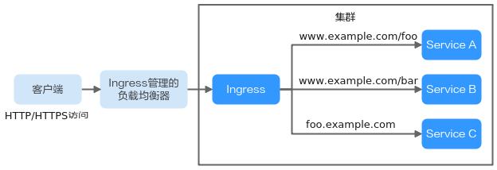
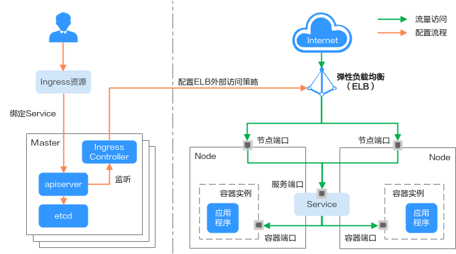
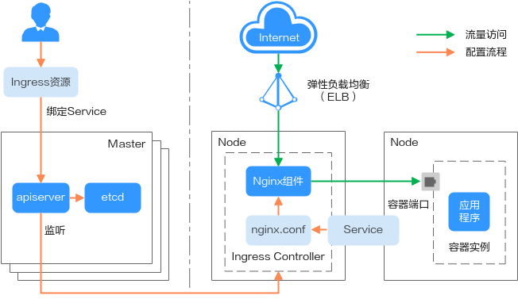

# 路由概述

尊重5w1h方法！

## 1、为什么需要ingress

Service 基于TCP和UDP协议进行访问转发，为集群提供了四层负载均衡的能力。  在实际场景中，Service无法满足应用层中存在着大量的HTTP/HTTPS访问需求。因此，Kubernetes集群提供了另一种基于HTTP协议的访问方式——Ingress。 

 Ingress是Kubernetes集群中一种独立的资源，制定了集群外部访问流量的转发规则。用户可根据域名和路径对转发规则进行自定义，完成对访问流量的细粒度划分。 

  

下面对Ingress的相关定义进行介绍：

+ Ingress资源：一组基于域名或URL把请求转发到指定Service实例的访问规则，是Kubernetes的一种资源对象，通过接口服务实现增、删、改、查的操作。
+ Ingress Controller：请求转发的执行器，用以实时监控资源对象Ingress、Service、End-point、Secret（主要是TLS证书和Key）、Node、ConfigMap的变化，解析Ingress定义的规则并负责将请求转发到相应的后端Service。


华为云上的ELB ingress 和nginx ingress 再原理上存在本质区别。因此支持的Service类型不同。

 ELB Ingress Controller部署在**master节点**，所有**策略配置和转发行为**均在**ELB**侧完成。非ELB直通Pod场景下，集群外部的ELB只能通过VPC的IP对接集群内部节点，因此ELB Ingres**s只支持NodePort**类型的Service。但是ELB直通Pod场景（CCE Turbo集群 + 独享型ELB实例）下，ELB可直接将流量转发到集群内Pod，此时Ingress可支持对接ClusterIP类型的Service。 

 Nginx Ingress Controller运行在集群中，作为服务通过**NodePort对外暴露**，流量经过Nginx-ingress转发到集群内其他业务，流量转发行为及转发对象均在集群内部，因此支持ClusterIP和NodePort类型的Service。 

 综上，ELB Ingress使用企业级LB进行流量转发，拥有**高性能和高稳定性**的优点，而Nginx Ingress Controller部署在**集群节点上**，牺牲了一定的集群资源但**可配置性相对更好**。 


#### ELB Ingress Controller工作原理

 CCE自研的ELB Ingress Controller基于弹性负载均衡服务ELB实现公网和内网（同一VPC内）的七层网络访问，通过不同的URL将访问流量分发到对应的服务。 

 ELB Ingress Controller部署于Master节点上，与集群所在VPC下的弹性负载均衡器绑定，支持在同一个ELB实例（同一IP）下进行不同域名、端口和转发策略的设置。ELB Ingress Controller的工作原理，实现步骤如下： 

1. 用户创建Ingress资源，在Ingress中配置流量访问规则，包括负载均衡器、URL、SSL以及访问的后端Service端口等。
2. Ingress Controller监听到Ingress资源发生变化时，就会根据其中定义的流量访问规则，在ELB侧重新配置监听器以及后端服务器路由。
3. 当用户进行访问时，流量根据ELB中配置的转发策略转发到对应的后端Service端口，然后再经过Service二次转发访问到关联的各个工作负载。


  ELB Ingress Controller工作原理 

  

#### Nginx Ingress Controller工作原理

 Nginx型的Ingress使用弹性负载均衡（ELB）作为流量入口，并在集群中部署[nginx-ingress插件]来对流量进行负载均衡及访问控制。 

 Nginx型的Ingress Controller通过pod部署在工作节点上，因此引入了相应的运维成本和Nginx组件运行成本，其工作原理如[图3]实现步骤如下： 

1. 当用户更新Ingress资源后，Ingress Controller就会将其中定义的转发规则写入到Nginx的配置文件（nginx.conf）中。
2. 内置的Nginx组件进行reload，加载更新后的配置文件，完成Nginx转发规则的修改和更新。
3. 在流量访问集群时，首先被已创建的负载均衡实例转发到集群内部的Nginx组件，然后Nginx组件再根据转发规则将其转发至对应的各个工作负载。

 Nginx Ingress Controller工作原理 

  


 CCE Turbo集群   不支持（节点访问服务关联实例已绑定eni网卡，独享型负载均衡无法对接）。


# ELB Ingress管理


# Nginx Ingress管理

## 前提条件

ingress为后端工作负载提供网络访问，因此集群中需提前部署可用的工作负载。

添加nginxingress时，需在集群中提前安装nginx-ingress插件。


## 注意事项

1、不建议再ELB服务修改ELB实例的任何配置，否则将导致服务异常。如果您已经误操作，请卸载nginx ingress插件后重装。

2、ingress转发策略中注册的URL需与**后端应用**提供访问的URL**一致**，否则将返回404错误。

3、负载均衡实例需与当前集群处于相同VPC且为相同公网或私网类型。

4、负载均衡实例需要拥有至少两个监听器配额，且端口80和443没有呗监听器占用。


#### 添加Nginx Ingress

本节以Nginx作为工作负载并添加Nginx Ingress为例进行说明。

1. 登录CCE控制台，单击集群名称进入集群。

2. 选择左侧导航栏的“服务发现”，在右侧选择“路由”页签，单击右上角“创建路由”。

3. 设置Ingress参数。

   

   + **名称：**自定义Ingress名称，例如nginx-ingress-demo。

   + **命名空间：**选择需要添加Ingress的命名空间。

   + 对接Nginx：

     集群中已安装

     nginx-ingress

     插件后显示此选项，未安装nginx-ingress模板时本选项不显示。

     单击开启后将对接nginx-ingress提供7层访问，可配置如下参数。

     **TLS配置**：nginx-ingress支持HTTP和HTTPS，安装nginx-ingress时预留的监听端口，默认HTTP为80，HTTPS为443。使用HTTPS需要配置相关证书。

     + 服务器证书：创建HTTPS协议监听时需要绑定TLS类型的密钥证书，以支持HTTPS数据传输加密认证，创建密钥的方法请参见[创建密钥](https://support.huaweicloud.com/usermanual-cce/cce_10_0153.html)。
     + SNI：SNI（Server Name Indication）是TLS的扩展协议，在该协议下允许同一个IP地址和端口号下对外提供多个基于TLS的访问域名，且不同的域名可以使用不同的安全证书。开启SNI后，允许客户端在发起TLS握手请求时就提交请求的域名信息。负载均衡收到TLS请求后，会根据请求的域名去查找证书：若找到域名对应的证书，则返回该证书认证鉴权；否则，返回缺省证书（服务器证书）认证鉴权。

   + 转发策略配置：

     请求的访问地址与转发规则匹配时（转发规则由域名、URL组成），此请求将被转发到对应的目标Service处理。单击

     “添加转发策略”

     按钮可添加多条转发策略。

     + 域名：实际访问的域名地址。请确保所填写的域名已注册并备案，在Ingress创建完成后，将域名与自动创建的负载均衡实例的IP（即Ingress访问地址的IP部分）绑定。一旦配置了域名规则，则必须使用域名访问。

     + URL匹配规则：

       + 默认：默认为前缀匹配。
       + 前缀匹配：例如映射URL为/healthz，只要符合此前缀的URL均可访问。例如/healthz/v1，/healthz/v2。
       + 精确匹配：表示只有URL完全匹配时，访问才能生效。例如映射URL为/healthz，则必须为此URL才能访问。

     + URL：需要注册的访问路径，例如：/healthz。

       说明：

       + Nginx Ingress的访问路径匹配规则是基于“/”符号分隔的路径前缀匹配，并区分大小写。只要访问路径以“/”符号分隔后的子路径匹配此前缀，均可正常访问，但如果该前缀仅是子路径中的部分字符串，则不会匹配。例如URL设置为/healthz，则匹配/healthz/v1，但不匹配/healthzv1。

       + 此处添加的访问路径要求后端应用内存在相同的路径，否则转发无法生效。

         例如，Nginx应用默认的Web访问路径为“/usr/share/nginx/html”，在为Ingress转发策略添加“/test”路径时，需要应用的Web访问路径下也包含相同路径，即“/usr/share/nginx/html/test”，否则将返回404。

     + 目标服务名称：请选择已有Service或新建Service。页面列表中的查询结果已自动过滤不符合要求的Service。

     + 目标服务访问端口：可选择目标Service的访问端口。

     + 操作：可单击“删除”按钮删除该配置。

   + **注解**：以“key: value”形式设置，可通过[Annotations](https://kubernetes.github.io/ingress-nginx/user-guide/nginx-configuration/annotations/)查询nginx-ingress支持的配置。

   

4. 配置完成后，单击“创建”。

   创建完成后，在Ingress列表可查看到已添加的Ingress。


## 通过Kubectl命令行创建Nginx Ingress

#### 添加Nginx Ingress

 1、创建名为“**ingress-test.yaml**”的YAML文件，此处文件名可自定义。 

**以HTTP协议访问为例，YAML文件配置如下。**

**1.23及以上版本集群**：

```yaml
apiVersion: networking.k8s.io/v1
kind: Ingress
metadata:
  name: ingress-test
spec:
  rules:
    - host: ''
      http:
        paths:
          - path: /
            backend:
              service: 
                name: <your_svc_name>  #替换为您的目标服务名称
                port:
                  number: <your_svc_port>  #替换为您的目标服务端口
              property:
                ingress.beta.kubernetes.io/url-match-mode: STARTS_WITH
              pathType: ImplementationSpecific
  ingressClassName: nginx
```


```yaml
apiVersion: networking.k8s.io/v1beta1
kind: Ingress
metadata:
  name: ingress-test
  namespace: default
  annotations:
    kubernetes.io/ingress.class: nginx   # 表示使用Nginx Ingress
spec:
  rules:
    - host: ''
      http:
        paths:
          - path: '/'
            backend:
              serviceName: <your_service_name>  #替换为您的目标服务名称
              servicePort: <your_service_port>  #替换为您的目标服务端口

```


